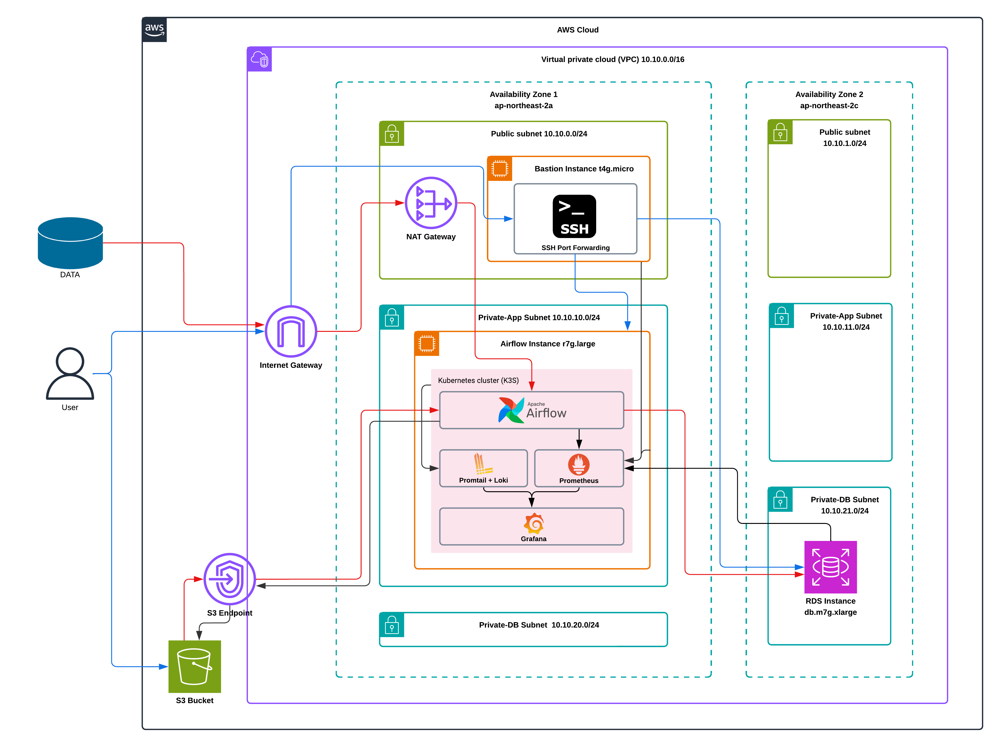

# AWS Infrastructure Example 1

이 디렉토리는 서울 리전(ap-northeast-2)에 운영 가능한 수준의 AWS 인프라를 Terraform으로 구축하는 예제를 담고 있습니다.

## 프로젝트 구조/특징



### 네트워크 (VPC)
- **서브넷**: Public, App, DB 서브넷으로 분리된 3계층 아키텍처
- **게이트웨이**: 외부 통신을 위한 IGW 및 프라이빗 서브넷을 위한 단일 NAT Gateway
- **VPC Endpoints**: 
    - Gateway 타입: S3
    - Interface 타입: ECR(API, DKR), Logs, SSM, Secrets Manager, EC2 Messages, SSM Messages

### 컴포넌트 상세
- **데이터베이스 (RDS MySQL)**
    - gp3 스토리지 사용
    - KMS 기반 암호화 적용
    - Multi-AZ 비활성화 (운영 비용 절감 목적, 필요시 활성화 가능)
    - 삭제 보호(deletion_protection) 활성화
- **EC2 인스턴스**
    - **Bastion Host**: 
        - t4g.micro (Amazon Linux 2023)
        - Elastic IP 할당
        - 보안 그룹: 특정 관리자 IP에서의 SSH(22) 접근만 허용
    - **Airflow Host**: 
        - r7g.large (Ubuntu 22.04 arm64)
        - 프라이빗 서브넷 배치
        - 보안 그룹: Bastion Host를 통해서만 SSH 접근 및 31000 포트 접근 허용
- **보안**: RDS 및 CloudWatch Logs를 위한 전용 KMS Key 생성 및 적용

## 디렉토리 구조
- `envs/prod`: 프로덕션 환경 배포를 위한 설정 파일 및 `tfvars`
- `modules`: 재사용 가능한 Terraform 리소스 모듈 모음
    - `ec2-instance`: Bastion 및 Airflow 인스턴스
    - `rds-mysql`: DB 설정
    - `s3`: 버킷 생성
    - `vpc`: 네트워크 기본 구성
    - `vpc_endpoints`: 엔드포인트 설정
    - `vpn`: (선택적) VPN 구성

## 시작하기

### 전제 조건
- Terraform >= 1.8.0
- AWS Provider ~> 6.9

### 배포 방법
1. **디렉토리 이동**:
    ```bash
    cd envs/prod
    ```
2. **초기화**:
    ```bash
    terraform init
    ```
3. **계획 확인**:
    ```bash
    terraform plan -var-file=prod.tfvars
    ```
4. **배포**:
    ```bash
    terraform apply -var-file=prod.tfvars
    ```

## 운영 주의사항
- **Bastion 접근 제어**: `prod.tfvars` 또는 보안 그룹 모듈에서 허용할 IP 대역을 정확히 설정해야 합니다.
- **리소스 삭제 시**: RDS 등 삭제 보호가 걸려 있는 리소스는 Terraform으로 삭제하기 전에 `deletion_protection = false`로 설정을 변경하고 적용해야 합니다.
